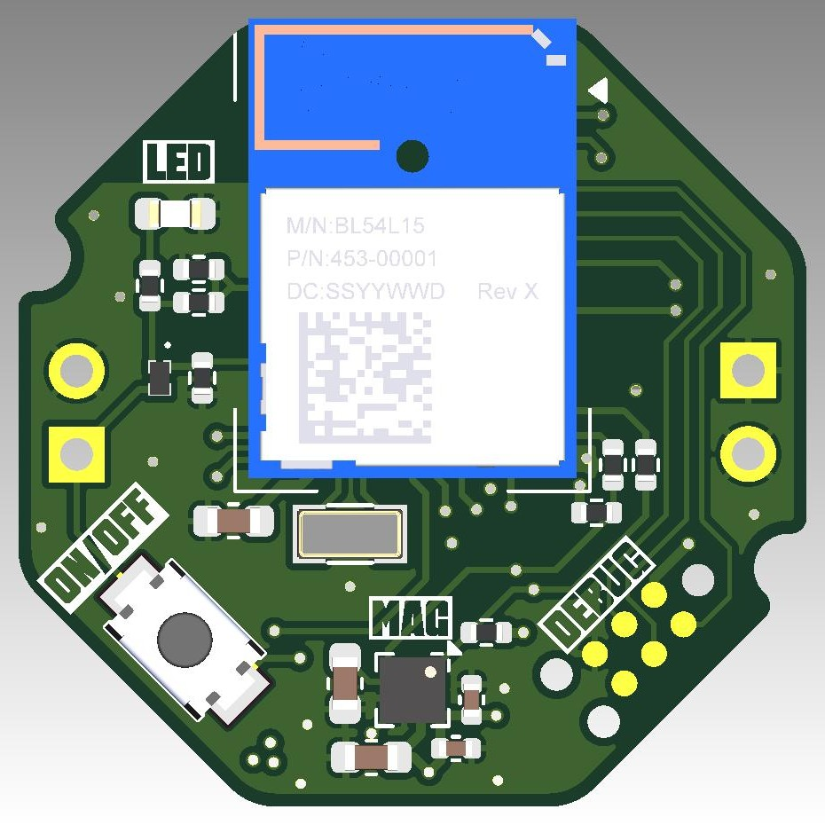
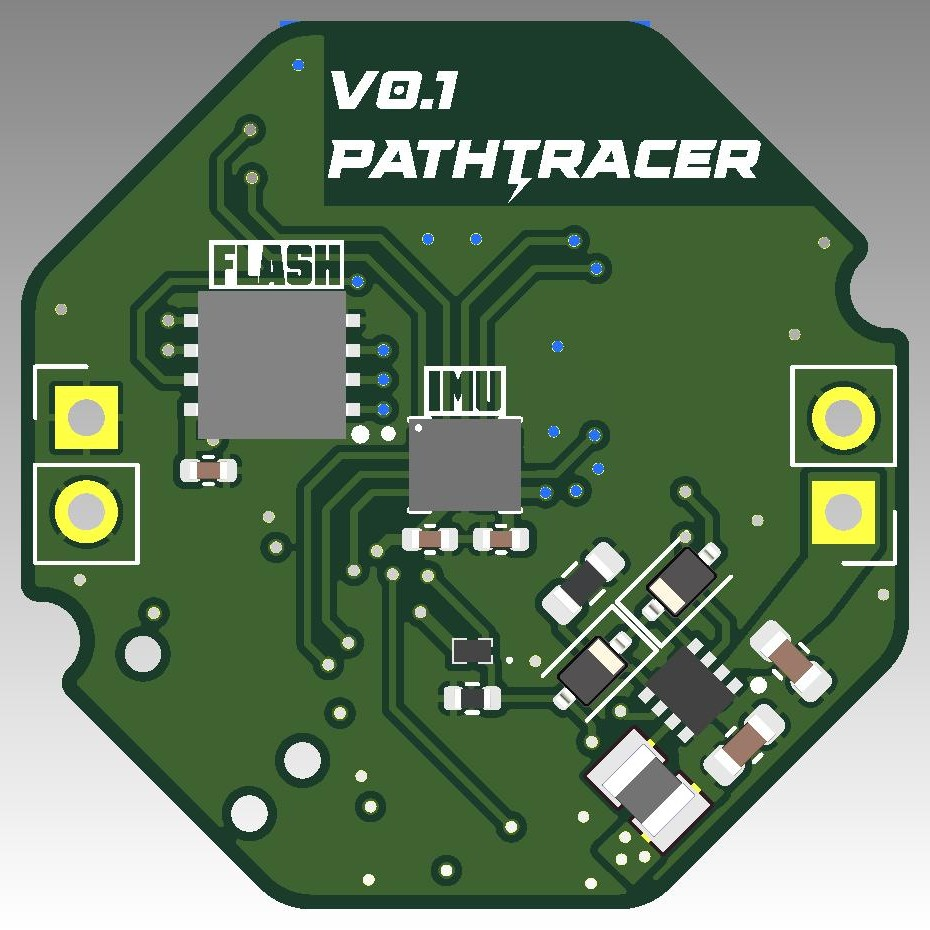
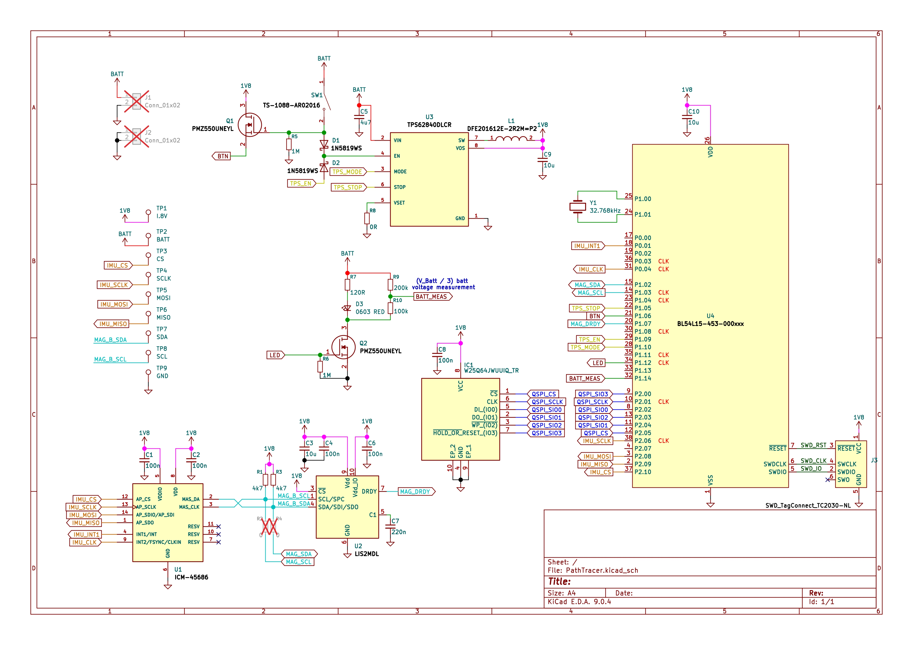

# PathTracer Showcase
PathTracer is a motion-tracking device that reconstructs the 3D path of swung objects (primarily golf clubs) to deliver measurable, repeatable swing analytics.

## Why PathTracer
- Video alone is 2D, lens-dependent, and subjective. PathTracer records true 3D motion at high resolution, turning "looks wrong" into precise metrics.
- Works for golf swings, barbell paths, and any motion where path accuracy matters.
- Lets you overlay your swing with reference data to see exactly where you deviate.

## Hardware and performance
- Core: nRF54L15 SoC with ICM-45686 IMU and LIS2MDL magnetometer.
- Power: TPS62840-based power path, rechargeable Li-Po cell, 1.8 V VDD for efficiency.
- Capture: 1600 Hz sampling (~51.2 kB/s) for acceleration and rotation, written directly to high-speed QSPI flash.
- Transfer: BLE offload to mobile/desktop for post-processing.
- Outputs: 3D path visualization, velocity, acceleration, rotation, swing tempo, and other derived metrics.

## Visuals
- Renders and prototypes  

- PCB stackup (4-layer)  

- Schematic overview  

- Real-world build (SD card for scale)  

