# PathTracer

**A compact BLE motion-tracking device that reconstructs the 3D path of a fast-moving object. Built end to end: hardware, firmware, desktop, and Android.**

  

PathTracer captures high-rate inertial and magnetic data on a moving object, stores it locally, streams it over BLE, calibrates it on the host, and replays the result as a 3D trajectory with motion metrics. It started as a V1 proof-of-concept and is now a V2 system spanning a 6-layer board, Zephyr firmware, a desktop companion app, and an Android control app.

> The hardware, firmware, desktop, and Android work live in separate private repositories. This repo is the public portfolio snapshot: the renders, board data, and engineering story.

---

## The problem

Fast swings and object paths are hard to inspect from video alone: camera angle, lens distortion, frame rate, and subjective interpretation all get in the way when the useful signal is a 3D path through space. The main subject is the golf swing, but the same capture works for other swung objects too, like a weightlifting barbell or a baseball bat.

High-end swing analysis is normally handled by multi-camera systems that cost several thousand dollars and are tied to a fixed bay or studio. PathTracer isn't trying to beat those. The goal is a *decent* analysis tool that is cheap enough to be approachable (around **$25** in hardware, with a **$100-150** retail price) and portable enough to carry anywhere, in a package roughly the size of four stacked quarters.

The approach is an embedded sensing pipeline: capture motion on the object itself, store it, move it over BLE, calibrate on the host, and visualize the path.

## V1: the first prototype

The goal was to prove that a small, object-mounted sensor package could capture a fast 3D path and replay it as something useful. V1 was the first cut: a 4-layer octagonal board built around the full **BL54L15** module, with the IMU, magnetometer, external flash, and power on a double-sided assembly, plus the first enclosure and club-mount concept.

It worked. The capture-store-offload-replay pipeline held together, and V1 produced the first real board shape, enclosure direction, and mounting concept. It also exposed what a production-quality revision had to fix: a soldered LiPo that was bulky and awkward to work with, board density, single-sided assembly, sensor centering, and host tooling. That set the agenda for V2.

| V1 board, top | V1 board, bottom |
| :---: | :---: |
|  |  |

### V1 copper layers (4-layer)

| | |
| :---: | :---: |
| **F.Cu**  | **In1.Cu**  |
| **In2.Cu**  | **B.Cu**  |

### V1 schematic

  

### V1 enclosure & build

| Enclosure & mount |
| :---: |
|   |

| Real build |
| :---: |
|   |

## From V1 to V2: the redesign

V1 proved the concept; V2 is the ground-up redesign around it. A few decisions drove the whole board:

**A smaller module: BL54L15u instead of the BL54L15.** Moving to the µ-module bought the space to:

- Fit the entire design on one side of the board while keeping the octagon within ~24 mm, and keep the IMU centered so that linear acceleration bleeds as little as possible into the rotation estimate.
- Use that single-sided layout to mount a rechargeable LIR2032 coin cell on the back, replacing V1's bulky, awkward soldered LiPo.
- Add on-board charging, so the cell never has to come out.

**Six layers, for free VIPPO.** The dense single-sided routing needs via-in-pad, plated-over (VIPPO) under the fine-pitch parts. JLCPCB includes VIPPO at no extra cost on 6-layer boards, so six layers gave better routing with no cost penalty.

**A faster flash.** The capture data rate is high enough that V2 needs a faster QSPI flash to keep up.

Supporting decisions:

- **Pragmatic IMU sourcing.** An ICM-45686 would be a stronger IMU, but supply constraints at design time made the LSM6DSV32X (±32 g, ±4000 dps) the practical choice for this revision. The capture pipeline is sensor-agnostic enough to revisit later.
- **Testpoints.** Most communication buses expose them for oscilloscope and logic-analyzer probing.
- **A charging PMIC.** Handles charging, ship-mode (true-off shelf storage), and battery/charger telemetry.

---

## System architecture

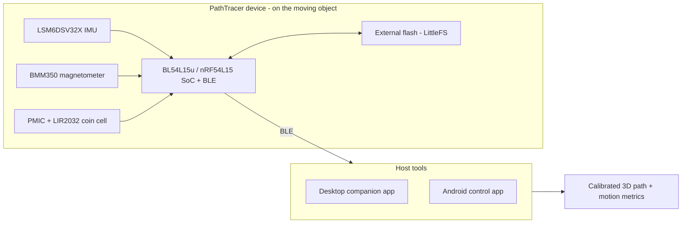

The device is the whole sensing front end: two motion sensors feed the BLE SoC, recordings land in external flash, and a PMIC manages a rechargeable coin cell. Everything past the radio is host-side software.

## Data pipeline

Recordings are captured on-device as raw typed records, wrapped in the `PTD2` binary container (metadata, CRC validation, timing fields), and moved to the host. The host validates the file, applies calibration, converts sensor-frame readings, estimates orientation, reconstructs the trajectory, and presents both raw and processed views.

## Hardware

The V2 board centers on the **BL54L15u / nRF54L15** BLE platform with dedicated motion sensors, external flash, PMIC telemetry, charging, **RGB LEDs** for device state and status, buttons, and programming/debug access. The 6-layer stack gives the redesign more routing freedom and cleanly separates the compact radio, power, sensor, and storage domains that a 4-layer prototype couldn't.

Assembly is intentionally **single-sided**: the active components live on one side, leaving the back free for a rechargeable **LIR2032** coin cell. That packaging choice saves enclosure volume while still targeting weeks of runtime, and the whole board runs on a **1.8 V VDD** rail to keep power draw low. The dense layout uses **VIPPO** construction under the fine-pitch parts, and most communication buses expose **testpoints** for oscilloscope and logic-analyzer probing.

Bare, the back shows the PathTracer silkscreen mark and a swing-path motif; fitted, the LIR2032 holder occupies it.

| Bare back | With the coin-cell holder |
| :---: | :---: |
|  |  |

*All board renders are generated from the KiCad design with [`tools/render-board.sh`](tools/render-board.sh).*

### Board stackup (V2, 6 layers, 1.6 mm FR4)

| Layer | Type | Thickness |
| --- | --- | --- |
| F.Mask | Solder mask | 0.010 mm |
| **F.Cu** | Copper (≈1 oz) | 0.035 mm |
| dielectric | Prepreg (FR4) | 0.100 mm |
| **In1.Cu** | Copper | 0.035 mm |
| dielectric | Core (FR4) | 0.535 mm |
| **In2.Cu** | Copper | 0.035 mm |
| dielectric | Prepreg (FR4) | 0.100 mm |
| **In3.Cu** | Copper | 0.035 mm |
| dielectric | Core (FR4) | 0.535 mm |
| **In4.Cu** | Copper | 0.035 mm |
| dielectric | Prepreg (FR4) | 0.100 mm |
| **B.Cu** | Copper | 0.035 mm |
| B.Mask | Solder mask | 0.010 mm |

*A symmetric prepreg/core build. V1 used a 4-layer stack on the same 1.6 mm FR4 budget (a thick 1.24 mm core between the inner layers).*

### V2 copper layers

| | | |
| :---: | :---: | :---: |
| **F.Cu**  | **In1.Cu**  | **In2.Cu**  |
| **In3.Cu**  | **In4.Cu**  | **B.Cu**  |

### V2 schematic

  

## Firmware

Built around a Zephyr application architecture:

- **Device modes:** idle, live, calibration, measuring, storing, deep sleep.
- **Sensor acquisition** from the LSM6DSV32X and BMM350, on both live and recorded paths.
- **External flash storage** with LittleFS file handling and raw-write staging.
- **BLE control** via SMP/MCUmgr: settings, time sync, measurement, calibration, stop, file list/delete, storage clear, ship mode, and DFU.
- **Notification services** for live motion samples, power telemetry, and device state.
- **`PTD2` recording format** for swing and calibration files.

## Desktop & Android tooling

**Desktop companion.** The main engineering and analysis tool: BLE scan/connect, live telemetry, rolling plots, power and device-state display, device control, file download/delete, firmware update, calibration workflows, local file browsing, parsed `PTD2` views, trajectory analysis, and 3D replay.

| Configuration & control | Parsed `PTD2` data explorer |
| :---: | :---: |
| 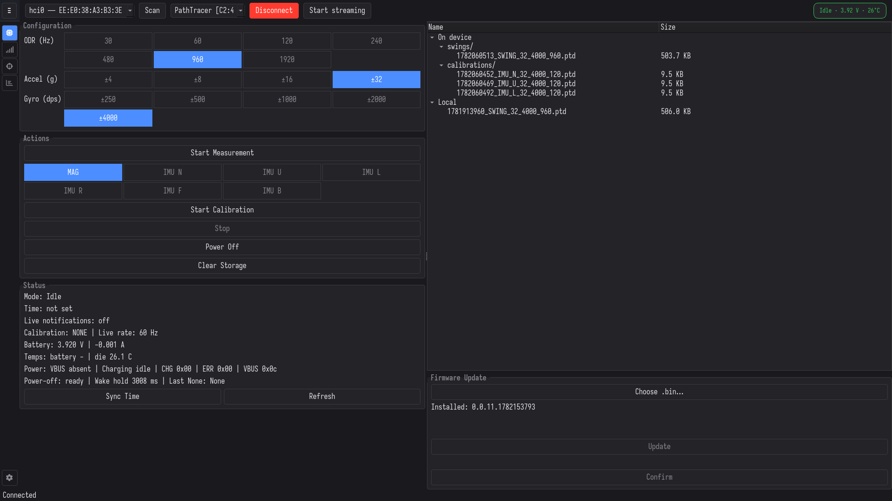 | 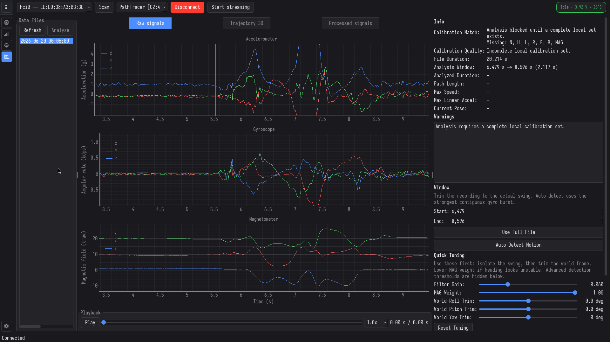 |

In live mode, rotating the device updates the on-screen orientation in real time:

  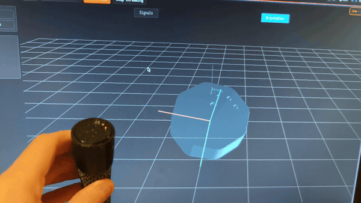

**Android app.** A lighter mobile controller: scan/connect, settings read/write, time sync, start measurement, start calibration, clear storage, file list/download/delete, plus the protocol stop command.

| Connection & settings | Actions & calibration | Recorded-data plotter | On-device files |
| :---: | :---: | :---: | :---: |
| 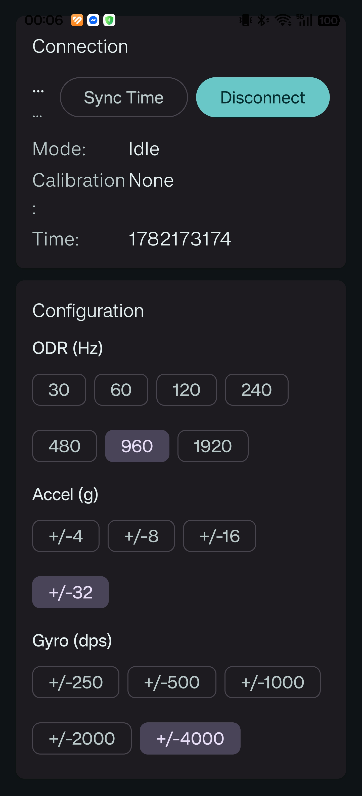 | 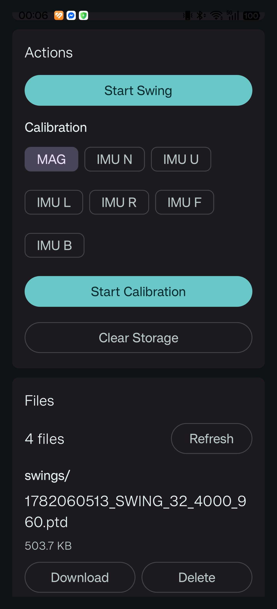 | 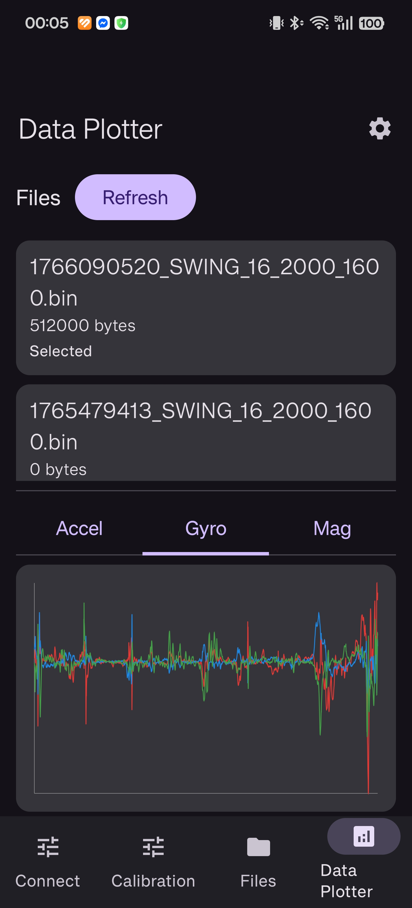 | 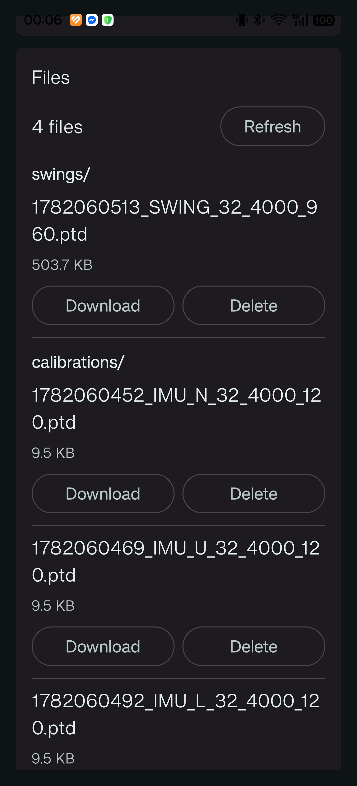 |

## Enclosure & build

The V2 enclosure is designed in Onshape around the single-sided board and back-mounted coin cell, and clamps onto a club grip.

### Designed in Onshape

| Enclosure | Holder | Mounted on a club |
| :---: | :---: | :---: |
| 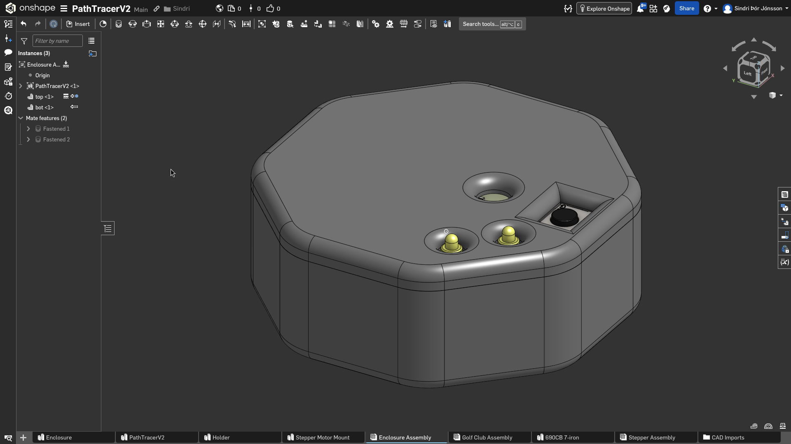 | 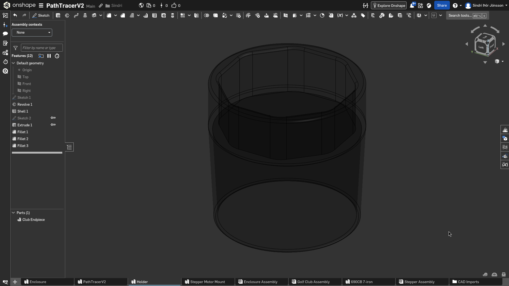 | 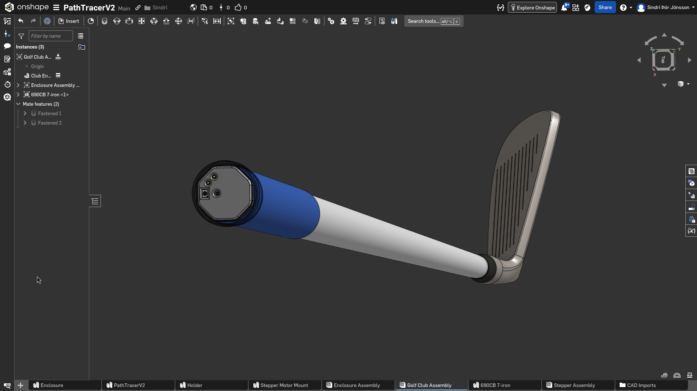 |

### The physical build

| 3D-printed enclosure with the V2 board | Mounted on a club grip |
| :---: | :---: |
|  |  |

## Status

Work in progress. The hardware, firmware, and host tooling are in place; the reconstruction math (orientation estimation and trajectory reconstruction) and end-to-end testing are still in development.
